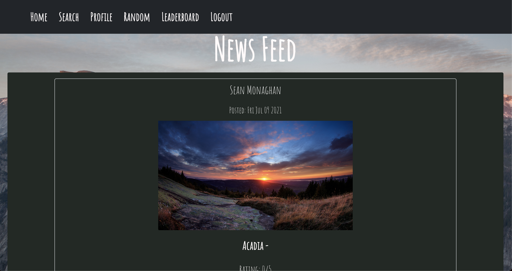
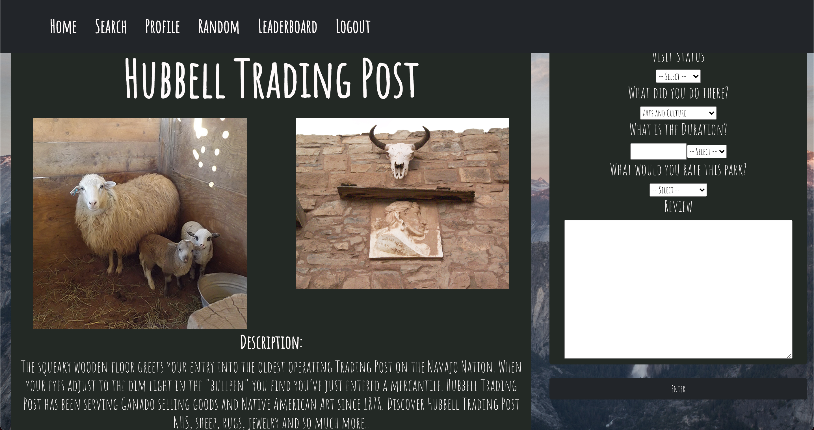

# Trek Gambit

[Description](#description) 

[Installation Instructions](#installation-instructions) 

[Site Overview](#site-overview) 
  

[Contribution Guidelines](#contribution-guidelines) 

[Tests](#tests) 
 
[Questions](#questions)

# Description

This application is designed to help you search for any national park and obtain all relevent information about each park. Create a profile to post about a visit or future visit and see it displayed on a home feed where you'll be able to see other posts from other users. The application is built using Javascript, HTML5, CSS, React, and the database created using Sequelize and MySQL. National park information is provided by the National Park services API.

https://www.nps.gov/subjects/developer/api-documentation.htm

Link to the Power point Presentation: 

INSERT POWERPOINT LINK

## Installation Instructions

INSERT DEPLOYED APP LINK

No need to install this application, it is live via Heroku and the link posted above.  

## Site Overview
Upon opening the site you are sent to a splash page where you will need to sign in or log in if you already created an account. Once logged in you will have the ability to search for any national park by simply typing in the name of the park or state that it's located in. When you search you will see the name, a picutur and brief description of the park as well as links to view the park page or go to the park website. The park page displays a description, price to enter, address, weather info, operating hours and contact information. Additionaly, on the park page you can create a profile which will allow you to post about a visit you had as well as rate the park. That post will be displayed on the home page where you can view other users posts about various other national parks that were visited.

The profile page will show you all of the posts you have made and if youre feeling spontaneous you can go to the random page that will display a random park if you need any inspiration for your next trip. The leaderboard page will display which user has the most visits and miles walked/biked/run etc. 

  
## License

This application uses the MIT license.

## Contribution Guidelines

If you would like to contribute to this project feel free to send requests.  I only wish that you be respectful to other contributes and to the code itself and maintain good clean coding practices. 

### Questions

If you have any questions about the application, be sure to contact us at our emails 
[Sean](mailto:smonagha@conncoll.edu)
[Jarret]
[Neel](mailto:neel.sheth109@gmail.com)
[Griffen]

Alternatively you can find us and our other works at our 
[Seans Github account](https://github.com/seanmonaghan).
